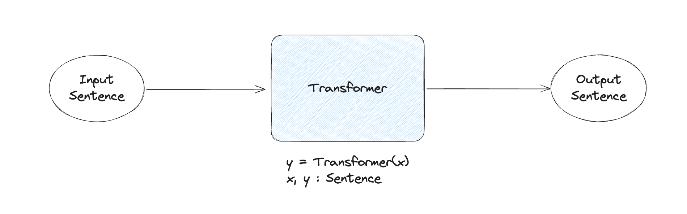
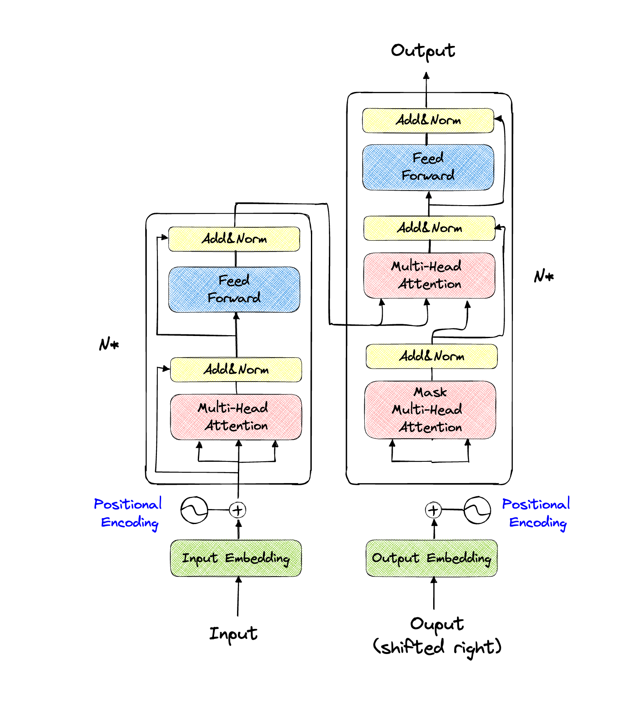

# Transformer (Attention Is All You Need)

**Transformer** 모델로부터 현재 많은 **모델**들이 생겨나고 있습니다. 
==GPT4, LLaMa==와 같은 모델 모두 Transformer의 architecture를 조금 더 발전시켜서 만들어진 모델 이므로 Transformer가 얼마나 대단한 모델인지 알 수 있습니다. 

---
## Model of Transformer

Transformer는 input 문장을 넣어서 output 문장을 생성해내는 모델입니다. 
- input과 동일한 문장을 만들수도, input의 역방향 문장을 만들수도, 번역을 할 수도 있습니다.(다른 언어로 변환) 
    - 모델의 학습과정에서 정해짐으로, labelling을 어떤 방식으로 하냐에 따라 모델이 달라질 수 있습니다. 
- finally, Transformer는 문장형태의 input이 들어가 문장형태의 output이 나오는 모델입니다. 
- 예를들어서, "안녕하세요"라는 문장이 들어갔을 때 "안녕하세요"도 나올 수 있고, "요세하녕안"이라는 말도 나올 수 있고, "HELLO"도 나올 수 있습니다. 

### Full Model Architecture
